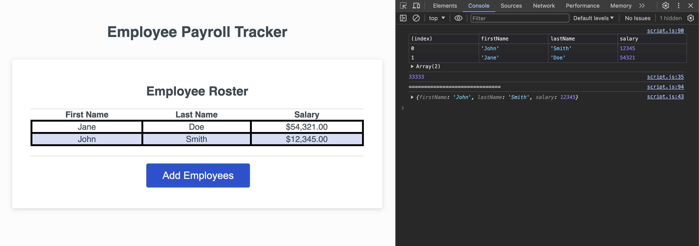

# Employee Payroll Tracker

## Description

This webpage is designed to help an employer log their employee's name and salary in an organized list. The application asks the user to answer a series of prompts an automatically organizes the information for them, based on the user input.

## Usage

To use this application, answer the given prompts then open the browser's console using Chrome DevTools. The console will show you the additional information of the average employee salary and randomly selected employee.

md

Deployment Link: 

## Credits
Source code courtesy of course content.
